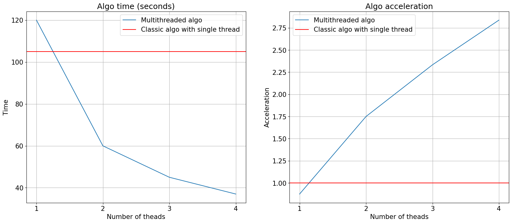

# Сравнение параллельной и однопоточной реализаций bfs

## Инструкция по воспроизведению эксперимента

Для воспроизведения экспериментов запустите `./run.sh <parallelism>`. Он скомпилирует файлы и повторит эксперимент 5 раз.
Эксперимент заключается в запуске сначала классического однопоточного алгоритма и затем параллельного алгоритма с указанной параллельностью. 
Для каждого алгоритма также проверяется корректность найденных расстояний (для графа, представляющего собой заполненный куб, правильные расстояния равны манхэттенским)

Параметр `<parallelism>` указывает число потоков в параллельной реализации BFS. Если равен нулю, параллельная версия алгоритма запущена не будет.
Однопоточная версия отличается от многопоточной с параллельностью равной единице.

Пример лога запуска эксперимента:
```
vsm@fedora:~/VSCodeProjects/pbfs$ ./run.sh 4
-- The C compiler identification is GNU 14.2.1
-- The CXX compiler identification is GNU 14.2.1
-- Detecting C compiler ABI info
-- Detecting C compiler ABI info - done
-- Check for working C compiler: /usr/bin/cc - skipped
-- Detecting C compile features
-- Detecting C compile features - done
-- Detecting CXX compiler ABI info
-- Detecting CXX compiler ABI info - done
-- Check for working CXX compiler: /usr/bin/c++ - skipped
-- Detecting CXX compile features
-- Detecting CXX compile features - done
-- Configuring done (0.5s)
-- Generating done (0.0s)
-- Build files have been written to: /home/vsm/VSCodeProjects/pbfs/build
[ 50%] Building CXX object CMakeFiles/pbfs.dir/main.cpp.o
[100%] Linking CXX executable pbfs
[100%] Built target pbfs

Running experiments with parallelsm=4

Experiment #1:
Algorithm found valid distances: true
Single threaded result: 105[s]
Algorithm found valid distances: true
Multi threaded result: 38[s]

Experiment #2:
Algorithm found valid distances: true
Single threaded result: 104[s]
Algorithm found valid distances: true
Multi threaded result: 38[s]

Experiment #3:
Algorithm found valid distances: true
Single threaded result: 104[s]
Algorithm found valid distances: true
Multi threaded result: 37[s]

Experiment #4:
Algorithm found valid distances: true
Single threaded result: 105[s]
Algorithm found valid distances: true
Multi threaded result: 37[s]

Experiment #5:
Algorithm found valid distances: true
Single threaded result: 105[s]
Algorithm found valid distances: true
Multi threaded result: 37[s]
```

## Результаты

Результаты замеров приведены на графиках:



В среднем ускорение на четырех потоках в `2.8` раз.

